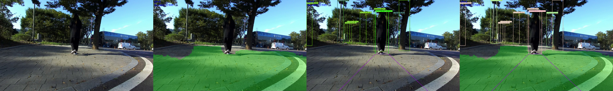
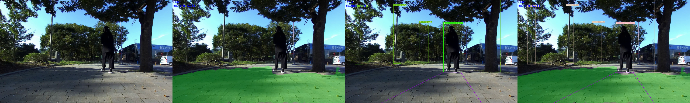

# Patrasche_YOLOPv2

Patrasche Project with YOLOPv2 (Model Modified by Youngwoo Shin)

## Important Notice
***자세한 구현 내용은 공개가 허용되지 않았기에 일부 실행에 필수적인 library 등은 보여지지 않습니다***


## 개요

성능 개선 및 속도 개선을 위해 아직 release 되지 않은 YOLOPv2 을 논문/YOLOP 모델을 참조하여 구성 후 학습, 파트라슈 엔진에 적용시킨다.
lane lane segmentation 및 drive area segmentation은 YOLOPv2 논문을 참조하되, detection head 부분은 YOLOP 에서 가져와 진행.

## Pretrained Model

### PyTorch

|모델명                                                  |기능|image size (heightXwidth)|batch size|model inference time (s)|total process time (s)|Download Link|
|---                                                    |---|---|---|---|---|---|
|[YOLOPv2](https://github.com/CAIC-AD/YOLOPv2)|Object Detection, Segmentation|384X640|1|0.02|0.11||
|[StrongSORT_OSNet](https://github.com/mikel-brostrom/Yolov5_StrongSORT_OSNet)|Object Tracking|256X128|16|0.03|0.11||

### TensorRT

|모델명                                                  |기능|image size (heightXwidth)|batch size|model inference time (s)|total process time (s)|Download Link|
|---                                                    |---|---|---|---|---|---|
|[YOLOPv2](https://github.com/CAIC-AD/YOLOPv2)|Object Detection, Segmentation|384X640|1|0.007(Server) 0.28(JetsonNano)|0.11(Server) 0.60(0.49)(JetsonNano)||
|[StrongSORT_OSNet](https://github.com/mikel-brostrom/Yolov5_StrongSORT_OSNet)|Object Tracking|256X128|16|0.04(Server) 0.11(0.035)(JetsonNano)|0.11(Server) 0.60(0.49)(JetsonNano)||

* StrongSORT_OSNet의 경우 batchsize가 16인 이유는 한 프레임을 처리할 시 최대 16개의 track-able 한 object가 나올 수 있다는 가정 하에 위의 batch size를 표기. 실제로는 한 개의 영상 프레임을 처리한다는 것을 내포.

* 하드웨어 문제로 JetsonNano에서는 2 개 이상의 tensorrt 실행 불가능 (파트라슈는 2개의 tensorrt 엔진 동시 구동) 때문에 성능에 별 영향 없는 torchreid를 torch모델로 사용. 괄호 안 값은 segfault 에러를 감안하고 tensorrt 를 2개 구동하여 측정 시 소요 시간

## 설치

### torchreid

트래킹에 앞서 인물 별 feature를 추출하기 위해 필요한 라이브러리.

torchreid 라이브러리 설치는 아래를 따라, 추후에 feature extractor를 수정하기 간편하도록 함.

```bash
cd deep-person-reid/
python setup.py develop
```

torchreid 관한 프레임워크 변환 방법은 [torchreid_conversion](torchreid_conversion.ipynb) 참조

### onnx

```bash
pip install onnxruntime-gpu
pip install onnx-simplifier
```

위의 커맨드로 간단히 onnx 설치 환경을 조성해준다.

변환방법은 [ONNX_Conversion](Onnx_Conversion.ipynb) 참조

### tensorrt
tensorrt의 경우 설치가 까다롭기에 docker image를 활용.

단, tensorrt의 버전에 따라 만들어지는 trt는 서로 호환이 되지 않기에 onnx -> tensorrt 로 변환한 tensorrt 버전과 tensorrt 엔진을 실행시키는 버전이 일치하도록 한다.

또한 onnx -> tensorrt 변환 전, constant folding 등의 문제로 에러가 날 수 있으니 미리 Polygraphy (onnx-surgeon) 을 이용하여 process 해 주어야 한다.

변환방법은 [TensorRT_Conversion](TensorRT_Conversion.ipynb) 참조


## 실행

### 실행 환경

N/A

### Torch

전체적 프로세스 실행 및 결과 영상을 보고 싶다면 아래 visualization flag를 준다.

```bash
python3 patrasche.py --visualization
```

만약 단순히 속도 측정만 할 경우에는 아래와 같이 실행한다.

```bash
python3 patrasche.py
```

단순히 도로 영역 추출, 혹은 객체인식/트래킹 결과 영상만 저장하고 싶다면 --seg-visualization, --track-visualization 옵션을 활용하면 된다.

### TensorRT

전체적 프로세스 실행 및 결과 영상을 보고 싶다면 아래 visualization flag를 준다.

```bash
python3 patrasche_trt.py --visualization
```

만약 단순히 속도 측정만 할 경우에는 아래와 같이 실행한다.

```bash
python3 patrasche_trt.py
```

단순히 도로 영역 추출, 혹은 객체인식/트래킹 결과 영상만 저장하고 싶다면 --seg-visualization, --track-visualization 옵션을 활용하면 된다.


## Demo

**데모는 원본, 도로 영역 추출, 객체인식/트래킹 결과, 종합 결과 순으로 정렬**






